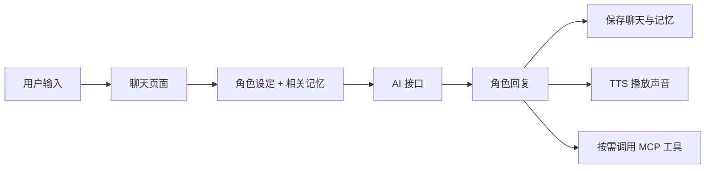
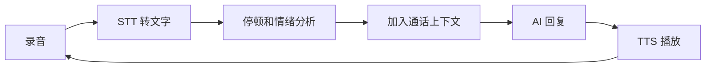

# 从零制作一个像 M叽一样的 AI 小手机

这是一份面向初学者的实践教程。我们的目标不是第一天就复制 M叽的所有功能，而是先做出一个真正能运行的“AI 小手机”，再逐步增加角色、长期记忆、语音通话和 MCP 工具。

M叽官方源码：<https://github.com/w1990709164-bot/Mji>

## 1. 什么是 AI 小手机

它并不是一台新的实体手机，而是一个做成“手机桌面”样式的 Android 应用。用户进入应用后，可以打开聊天、电话、日记、相册、音乐等小应用；这些页面共享同一批 AI 角色和记忆。

最核心的数据流只有下面这一条：



理解这条主线后，天气、日记、论坛和宠物屋等功能都只是新的页面与上下文。

## 2. 先确定第一版范围

建议第一版只完成五件事：

1. 一个仿手机桌面。
2. 创建和选择 AI 角色。
3. 给角色发送文字并收到回复。
4. 本地保存聊天记录。
5. 让角色朗读回复。

等这五件事稳定后，再做语音通话、长期记忆、世界书、群聊和 MCP。一次加入太多功能，会让网络、界面、数据库和权限问题混在一起，很难排查。

## 3. 准备开发环境

需要：

- Windows、macOS 或 Linux 电脑
- Android Studio
- Android SDK
- Android 8.0 以上的手机，或者 Android 模拟器
- 一个兼容 OpenAI Chat Completions 格式的 AI 接口

在 Android Studio 中新建项目时选择 **Empty Views Activity**，语言选择 Kotlin，最低系统版本选择 API 26。M叽当前也以 API 26 为最低版本。

如果直接研究 M叽源码，请先阅读：[下载、编译与安装简易教程](下载编译安装教程.md)。

## 4. 看懂 M叽的项目结构

M叽当前是单 `app` 模块 Android 项目，主要目录如下：

```text
Mji/
├─ app/src/main/
│  ├─ java/com/moon/aiphone/   Kotlin 业务代码
│  ├─ res/layout/              Android XML 页面
│  ├─ res/drawable/            图标和背景
│  ├─ assets/                  HTML 小应用和聊天模板
│  └─ AndroidManifest.xml      页面、服务和权限声明
├─ docs/                       设计与教程文档
├─ build.gradle.kts            项目构建配置
└─ app/build.gradle.kts        App 依赖和 Android 配置
```

最值得先看的文件：

| 功能 | M叽中的对应文件 |
|---|---|
| 小手机桌面 | `MainActivity.kt`、`activity_main.xml` |
| 单人聊天 | `ChatActivity.kt`、`chat_template.html` |
| 角色设置 | `CharacterSettingsActivity.kt` |
| 本地数据库 | `DatabaseHelper.kt` |
| 长期记忆 | `MemoryManager.kt` |
| 文字转语音 | `TTSManager.kt` |
| AI 语音电话 | `CallActivity.kt` |
| 全局接口设置 | `SettingsActivity.kt` |
| MCP 工具 | `McpManager.kt`、`McpSettingsActivity.kt` |

初学时不必逐行阅读 `ChatActivity.kt`。先找到“发送消息 → 组装提示词 → 请求接口 → 显示回复”四个位置即可。

## 5. 第一步：制作小手机桌面

先建立一个 `MainActivity`，用网格展示聊天、设置、日记和电话四个图标。每个图标点击后打开对应 Activity。

简单写法：

```kotlin
findViewById<View>(R.id.appChat).setOnClickListener {
    startActivity(Intent(this, ChatActivity::class.java))
}

findViewById<View>(R.id.appSettings).setOnClickListener {
    startActivity(Intent(this, SettingsActivity::class.java))
}
```

然后在 `AndroidManifest.xml` 注册页面：

```xml
<activity android:name=".ChatActivity" />
<activity android:name=".SettingsActivity" />
```

这一阶段只关注页面能否正常打开，不要急着接 AI。

M叽的 `MainActivity.kt` 还负责壁纸、桌面角标、音乐组件和角色选择。自己的第一版可以先省略这些功能。

## 6. 第二步：建立角色系统

一个角色至少需要以下字段：

```kotlin
data class Character(
    val id: String,
    val name: String,
    val avatarPath: String,
    val persona: String,
    val voiceId: String
)
```

- `id`：永远不变的角色标识。
- `name`：界面显示名称。
- `avatarPath`：头像位置。
- `persona`：性格、关系、说话习惯和边界。
- `voiceId`：该角色使用的声音。

角色选择必须始终以 `id` 为准，不能只按名字或列表位置选择。声音也应保存在当前角色记录中，不能用一个全局默认声音覆盖所有角色。M叽之前出现“新增声音被 Krueger 掩盖”的根源，就属于角色声音回退与全局默认值优先级不清晰。

推荐的声音优先级是：

```text
当前角色 voiceId
    ↓ 没有设置
用户选择的全局默认 voiceId
    ↓ 仍然没有
程序内置的安全默认声音
```

切换角色时，必须重新读取该角色的 `voiceId`，不要继续使用上一个角色的内存缓存。

## 7. 第三步：保存设置和 API Key

初学版本可以用 `SharedPreferences` 保存接口设置：

```kotlin
val prefs = getSharedPreferences("settings", MODE_PRIVATE)
prefs.edit()
    .putString("apiUrl", apiUrl)
    .putString("apiKey", apiKey)
    .putString("modelName", modelName)
    .apply()
```

读取时：

```kotlin
val apiUrl = prefs.getString("apiUrl", "") ?: ""
val apiKey = prefs.getString("apiKey", "") ?: ""
```

注意：

- 不要把自己的 API Key 直接写进源码。
- 不要把 `.env`、`local.properties` 或签名文件提交到 GitHub。
- 正式产品应使用 Android Keystore 或加密存储；`SharedPreferences` 适合学习版，不等于高安全保险箱。
- 日志里不要打印完整请求头或密钥。

M叽的全局配置集中在 `SettingsActivity.kt`，包括对话模型、TTS、情绪识别、图片生成和向量模型。

## 8. 第四步：接入 AI 对话

在 `app/build.gradle.kts` 加入网络库：

```kotlin
implementation("com.squareup.okhttp3:okhttp:4.12.0")
```

Manifest 中加入网络权限：

```xml
<uses-permission android:name="android.permission.INTERNET" />
```

每次发送消息时，按下面顺序组装内容：

```text
系统提示词
角色设定
当前时间和场景
召回的长期记忆
最近若干条聊天记录
用户的新消息
```

简化请求示例：

```kotlin
val body = JSONObject().apply {
    put("model", modelName)
    put("messages", JSONArray().apply {
        put(JSONObject().put("role", "system").put("content", persona))
        put(JSONObject().put("role", "user").put("content", userText))
    })
}.toString().toRequestBody("application/json".toMediaType())

val request = Request.Builder()
    .url("${apiUrl.trimEnd('/')}/v1/chat/completions")
    .header("Authorization", "Bearer $apiKey")
    .post(body)
    .build()
```

网络请求不能阻塞 Android 主线程。可以使用 OkHttp 的 `enqueue`，拿到回复后通过 `runOnUiThread` 更新页面。

还要处理四种失败情况：

- 没填接口地址或密钥。
- 网络断开或超时。
- 接口返回 401、429、500 等错误。
- 回复 JSON 中缺少预期字段。

不要把接口错误假装成角色回复，否则用户会分不清剧情与系统故障。

## 9. 第五步：保存聊天记录

M叽使用 `SQLiteOpenHelper`，核心入口是 `DatabaseHelper.kt`。学习版可以先建立一张表：

```sql
CREATE TABLE messages (
    id INTEGER PRIMARY KEY AUTOINCREMENT,
    character_id TEXT NOT NULL,
    role TEXT NOT NULL,
    content TEXT NOT NULL,
    created_at INTEGER NOT NULL
)
```

发送消息时先保存用户消息，收到响应后再保存 AI 消息。查询历史时必须带 `character_id`，否则不同角色的聊天会混在一起。

数据库版本升级时，不要直接删除用户数据库。增加字段应编写迁移逻辑，并在真机旧版本数据上测试。

## 10. 第六步：加入长期记忆

“聊天记录”和“长期记忆”不是一回事：

- 聊天记录保留原话，用于查看历史。
- 长期记忆保存关系变化、偏好、承诺和重要事件。

简单记忆系统可以这样工作：

1. 每完成若干轮对话，让 AI 提取一段简短记忆。
2. 保存记忆正文、角色 ID、类别和时间。
3. 用户发新消息时，先找出最相关的 3～5 条记忆。
4. 把它们放入提示词，但不要把全部记忆都发送给模型。

没有向量模型时，可以先做关键词匹配。稳定后再加入 Embedding 和余弦相似度：

```text
用户消息 → 生成向量 → 与记忆向量比较 → 取相似度最高的几条
```

M叽的 `MemoryManager.kt` 同时支持本地关键词评分和向量召回。每条记忆必须绑定角色 ID，避免 A 角色读到 B 角色的私人记忆。

## 11. 第七步：让角色开口说话

TTS 的输入是 AI 回复文字，输出是音频文件或音频流。基本流程：

```text
AI 回复 → 清理舞台动作和特殊符号 → 选择当前角色声音
       → 调用 TTS → 缓存音频 → MediaPlayer 播放
```

建议把 TTS 单独封装成 `TTSManager`，聊天页面只调用：

```kotlin
ttsManager.speak(aiReply, currentCharacter.voiceId)
```

需要注意：

- 新回复播放前停止旧音频，避免重叠。
- 页面销毁时释放播放器。
- 没有可朗读文字时不要请求接口。
- 网络失败时允许继续看文字，不要阻塞聊天。
- 声音 ID 应跟角色绑定，并按上一节所述的优先级回退。

M叽的实现位于 `TTSManager.kt`，并允许在设置页选择不同 TTS 提供方。

## 12. 第八步：制作 AI 语音电话

语音电话其实是一个循环：



需要在 Manifest 中申请：

```xml
<uses-permission android:name="android.permission.RECORD_AUDIO" />
```

运行时还要请求麦克风权限。第一版建议使用“按住说话”或“点击结束录音”，稳定后再做自动判断说话结束。

### 让角色听懂情绪和停顿

仅把录音转成文字，会丢失语速、音量和沉默信息。可以补充两类信号：

1. 本地停顿特征：总时长、最长停顿、停顿次数、平均音量变化。
2. 音频情绪模型：输出平静、开心、悲伤、紧张、愤怒等标签及置信度。

把分析结果作为“观察”，而不是绝对事实：

```text
[通话观察]
用户说话较慢，中间有两次明显停顿；情绪模型推测为低落，置信度 0.68。
请温和回应，不要直接宣称用户一定在难过。
```

这样能降低模型误判带来的冒犯。M叽的 `CallActivity.kt` 已包含录音、STT、振幅采样、停顿分析和可选语音情绪接口，可以沿着以下函数阅读：

```text
startRecording
stopRecordingAndTranscribe
startAmplitudeSampling
analyzeSpeechPauses
startVoiceMoodAnalysis
sendToAi
```

## 13. 第九步：加入世界书和角色关系

世界书用于保存地点、人物、组织和规则。不要每次把整本世界书塞给模型，而应根据当前消息匹配关键词，只注入相关条目。

角色关系可以保存：

- 关系名称
- 好感或信任变化
- 重要共同经历
- 角色对用户的称呼
- 当前场景状态

提示词建议分层：

```text
不可违反的系统规则
→ 角色核心设定
→ 当前关系
→ 相关世界书
→ 相关长期记忆
→ 最近聊天
→ 本轮输入
```

越靠前的内容优先级越高。用户可编辑的数据也要做长度限制，避免提示词无限膨胀。

## 14. 第十步：加入 MCP 工具

MCP 可以让角色调用天气、日历、搜索或其他远程工具。对于手机应用，推荐先支持远程 HTTP MCP 服务，而不是直接在手机上执行任意 GitHub 代码。

安全流程应当是：

```text
用户粘贴 URL
→ 校验 HTTPS 和允许的地址
→ 读取服务声明
→ 展示将获得的权限
→ 用户确认安装
→ OAuth 或令牌授权
→ 获取工具列表
→ 每次调用记录日志
```

GitHub 仓库链接本身不等于可安装 MCP。仓库必须提供 M叽能够识别的远程服务配置或清单；普通源码仓库不能自动在手机里安全运行。

M叽的 `McpManager.kt` 负责：

- 规范化输入地址。
- 识别 GitHub 仓库。
- 寻找配置文件。
- 发现工具。
- 调用工具并保存日志。
- 处理 OAuth 授权需求。

必须防范：

- 内网地址和本机地址探测（SSRF）。
- 工具偷偷读取其他角色数据。
- 自动执行安装脚本。
- 未经确认的付费、发帖、删除和账户操作。
- OAuth 回调被其他应用冒用。

高风险工具每次执行前都应再次让用户确认。

## 15. 增加其他“小应用”

完成主线后，可以逐个增加：

- AI 日记：把当天聊天摘要成日记。
- 日历：让角色了解预约，但修改日程前确认。
- 论坛或朋友圈：使用角色和世界观生成内容。
- 音乐：分享歌曲信息，不要把未经授权的音乐打包进仓库。
- 宠物屋：用本地状态机记录饥饿、心情和成长。
- 图片生成：将角色外观和当前场景组合成提示词。

每个小应用都应复用同一个角色 ID、数据库和设置系统，不要各自保存一份互不相通的角色资料。

## 16. 隐私和安全底线

AI 小手机会接触聊天、声音、照片和密钥，至少做到：

1. 权限用到时再申请，并说明原因。
2. 默认不上传与当前功能无关的数据。
3. 设置页提供删除聊天、记忆和缓存的入口。
4. 导出数据前提醒其中可能包含隐私。
5. API Key 不写入源码、不上传 GitHub、不打印到日志。
6. WebView 只暴露必要的 JavaScript 接口。
7. OAuth 使用随机 `state` 并校验回调。
8. MCP 工具按服务器和角色隔离权限。
9. AI 对情绪的判断只能作为推测，不能冒充医学诊断。
10. 发布前检查图片、字体、音乐和角色素材的授权。

## 17. 调试顺序

遇到问题时按层检查，通常比到处改代码有效：

1. 页面是否能打开。
2. 输入内容是否正确取得。
3. 设置是否正确读取。
4. 请求 URL、模型名和 JSON 是否正确。
5. HTTP 状态码和响应体是否正常。
6. 回复是否成功解析。
7. 数据库是否保存。
8. TTS 是否收到正确角色的声音 ID。
9. 生命周期结束时录音和播放器是否释放。

日志应描述发生了什么，但要遮盖密钥和私人文本。

## 18. 推荐开发路线

### 阶段 A：能聊天

- 桌面
- 设置页
- 单角色文字聊天
- 本地历史记录

### 阶段 B：像一个角色

- 多角色
- 角色卡
- 世界书
- 长期记忆
- 每个角色独立声音

### 阶段 C：像在打电话

- STT
- TTS
- 停顿检测
- 情绪观察
- 打断与播放状态管理

### 阶段 D：像一部小手机

- 日记、日历、论坛等小应用
- 主动消息和通知
- 备份与恢复
- 主题和壁纸

### 阶段 E：连接外部世界

- MCP 工具发现
- GitHub 配置导入
- OAuth
- 权限确认和调用日志

每完成一个阶段，都在真机上走一遍完整流程，再开始下一阶段。

## 19. 编译和发布

调试构建：

```powershell
.\gradlew.bat :app:assembleDebug
```

构建成功后，APK 一般位于：

```text
app\build\outputs\apk\debug\app-debug.apk
```

公开发布前还需要：

- 修改包名、应用名、图标和版本号。
- 创建自己的发布签名，并离线备份。
- 使用 release 构建测试安装和升级。
- 写清隐私政策、接口费用和数据去向。
- 检查第三方依赖与素材许可证。
- 为发布 APK 提供 SHA-256 摘要。

M叽使用 PolyForm Noncommercial License 1.0.0。学习或修改 M叽源码时，应保留 `LICENSE`、`NOTICE` 和 Required Notice；未经版权所有者另行许可，不得用于收费分发或商业倒卖。

## 20. 最重要的三个原则

1. **先做通，再做好看。** 先验证一条完整聊天链路，再调整桌面动画和皮肤。
2. **角色数据必须隔离。** 聊天、记忆、声音和工具权限都以角色 ID 关联。
3. **AI 判断不是事实。** 尤其是情绪、健康和关系推断，要允许不确定并把控制权交给用户。

做到这里，你就已经拥有了一个结构完整的 AI 小手机。接下来不管增加日记、宠物屋还是新工具，本质上都是在同一条“角色 + 上下文 + AI + 本地状态”主线上增加新的入口。

